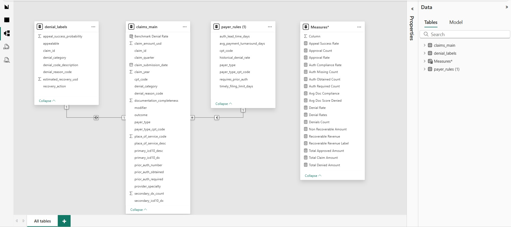
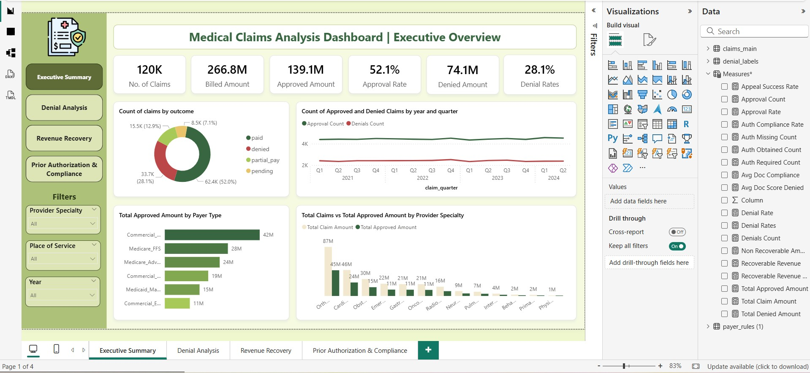
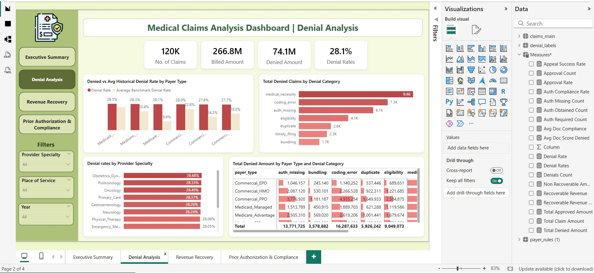
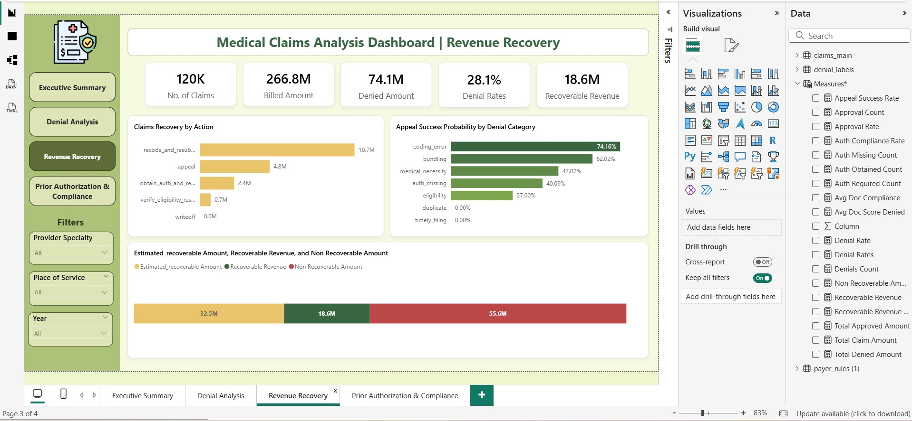
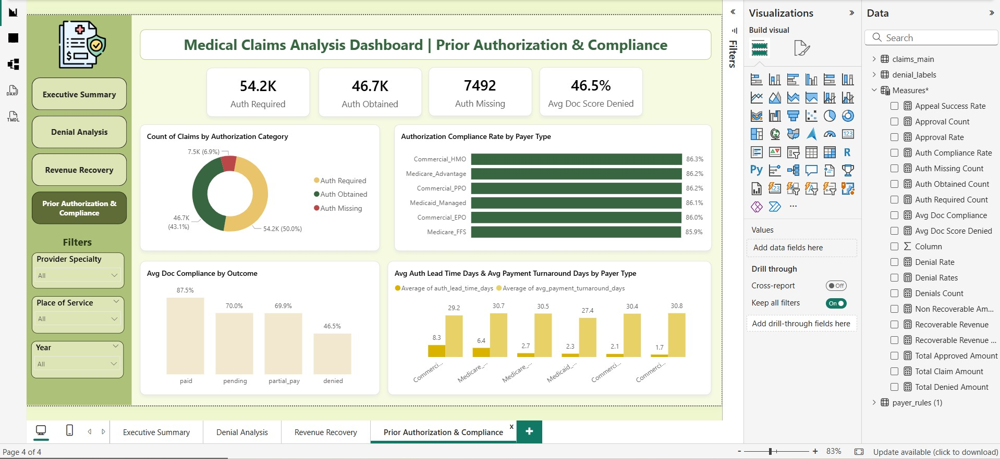

# 🏥 Turning Medical Claims Data into Actionable Revenue Cycle Insights 
This project is designed to provide an executive-level view of claims performance, denial drivers, revenue recovery opportunities, and prior authorization compliance.
The goal was to answer practical business questions:  
💡 Where are we losing revenue?  
💡 Why are claims being denied?  
💡 Which denials are recoverable?  
💡 Where can better authorization and documentation processes prevent future denials?  

## 🛠️ Data Modeling & DAX
- Built a star schema linking transactional claims data (Fact table) with Payer rules and Denial labels tables.
- Created composite keys by combining Payer Type and CPT Code to improve relationships between Claims_Main and Payer_Type tables.
- Calculated dynamic measures including Approval Rate, Denial Rate, Recoverable Revenue, Auth Compliance Rate, and Documentation Completeness.
- Actual vs benchmark denial rate comparison using RELATED and AVERAGE

## 📊 The dashboard is structured into four perspectives:
1️⃣ Executive Overview — overall claims, approval, denial and financial performance  
2️⃣ Denial Analysis — denial drivers, payer/specialty patterns and denial categories  
3️⃣ Revenue Recovery — recoverable revenue, recovery actions and appeal prioritization  
4️⃣ Prior Authorization & Compliance — authorization gaps, documentation quality and payer turnaround metrics  

## 📈 Key Insights
💰 $266.8M billed across ~120K claims. Of this, approximately $139.1M was approved (overall approval rate of 52.1%), while $74.1M was denied, resulting in an overall denial rate of 28.1%.

🚨 Denial Drivers
- Medical necessity is the biggest denial driver, accounts for approximately 9.4K denied claims, followed by coding errors (~7.3K) and missing authorization (~6.1K).
- This suggests that denial prevention needs to go beyond billing operations and involve clinical documentation, coding quality, and authorization workflows.
- Every payer in this portfolio is running above their historical benchmark denial rate. Medicare FFS actual denial rate: 28.1%. Benchmark: 10.8%. That 17-point gap represents millions in preventable denials.
- Denied claims average a documentation completeness score of 47% vs 88% for paid claims. That 41-point gap is a big controllable denial driver.

💵 Significant revenue recovery opportunity
- The analysis estimates approximately $32.5M in potentially recoverable denied amounts, with $18.6M identified as recoverable revenue and $55.5M written off (non-recoverable).
- The largest recovery opportunity comes from recode/resubmission ($10.7M), followed by appeals and authorization-related recovery actions.

📌 Appeal strategy should be selective
Appeal success probability varies substantially by denial category. For example, coding errors show an estimated appeal success probability of 74.16%, while eligibility is around 27%. Some categories show little or no modeled appeal opportunity. That means recovery teams can prioritize their efforts based on expected return rather than simply appealing every denial.

🔐 Prior authorization is another major opportunity
The dashboard shows:
- 54.2K claims requiring authorization
- 46.7K with authorization obtained
- 7.5K with authorization missing
- Overall authorization compliance of roughly 86%
The payer-level analysis also highlights differences in compliance and authorization lead times, providing an opportunity to improve workflows before the claim reaches the denial stage.

## 🙏 Credits: 
The analysis, dashboard design, and presentation were developed as part of my own learning and practice from Smart Data Learners Youtube Channel.
